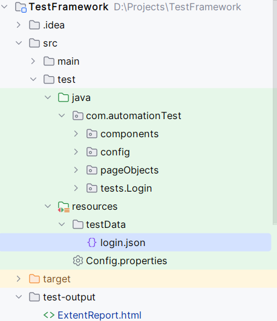
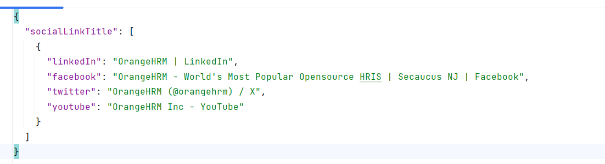

# **Selenium TestNG Automation Framework**

This Automation framework allows automated tests to be executed in parallel using TestNG, with test data provided in a JSON file.

To get started sample code are available inside the framework for ORANGE HRM website (https://opensource-demo.orangehrmlive.com/web/index.php/auth/login)

## Getting Started
Clone the repository to your machine and start modifying the code.

## Framework Structure
Automation test code are organized in side src/test/java directory

#### Components package
Reusable components (like Navigation menu, Dropdown etc.) are created and can be used inside Page Objects.

#### Config package
Contains Java Class for Test Configuration (TestConfig.java), Extent Reporter Configuration (ExtentReportManager.java), Json Data Provider utility (JsonDataProviderUtil.java).

#### PageObjects package
Page Class can be created and organized inside **pageObjects** package.

#### Tests package
Test Class can be created and organized inside **tests** package.

## Providing Test Data to Test
Insider resources/testdata folder JSON test data files are organized.

In this framework Test Data can be given through Json file. To overcome the disadvantages of Excel file for storing test data Json file is used.

Create a json file and place a array object inside the json to provide test data to Test Class. Don't forget to implement Dataprovider method inside test class.
 Here is the sample test data json. In this test data **socialLinkTitle** is the array object that can provide test data to Test class.

#### Config file
Some of the basic configuration data are added to Config.properties file. Modify the config data based on need😉.